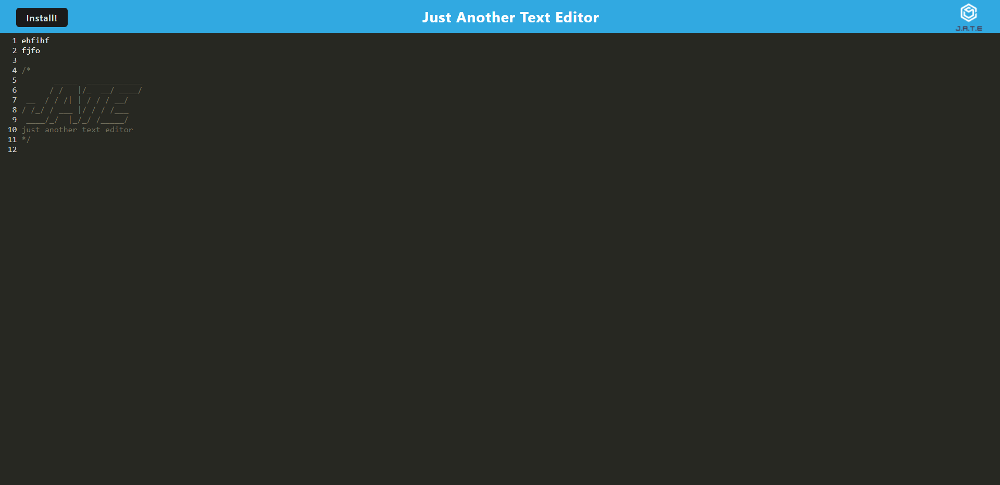

## weather webpage

## Description

-Text editing can be a headache, as most of them ask for a sybscription fee. So this gave me an idea to create a text editing app which will run free of cost.

-To achieve my goal, I created JATE, In it you can type and save your data in the cache, plus it gives you the iption to download it on you machine.

-Java script was totally new to me, so I learned it and used it in a way which enhances my understanding of it.

## Table of contents

-installation
-Download and install Git bash
-Open your Git bash application
-Type in command mkdir JATE
-By using cd command go into JATA
-Enter git clone https://github.com/sachmilan/textEditor.git

## Credits

Sachmilan Singh.

## Usage

With this applictation you can type in the text it will save ti in the cache for you, so that next time when you start the application, your important work would not be lost.

 

https://cryptic-earth-55820.herokuapp.com/

## Features

It is extreamly user friendly, it can store your data for you.

## How to contribute

You can always look at the HTML code and the CSS styling  which I use. I trust myself completely; however, not a single man on this earth is perfect, so if you find a better way to code the JATE app, or find any fault in my code, feel free to contact me on Linkedin, Github and Gmail, all you have to do is to search my name- Sachmilan Singh.

